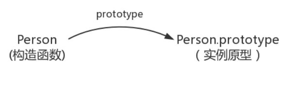
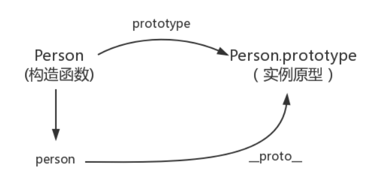
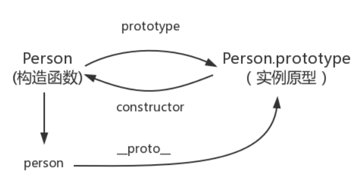
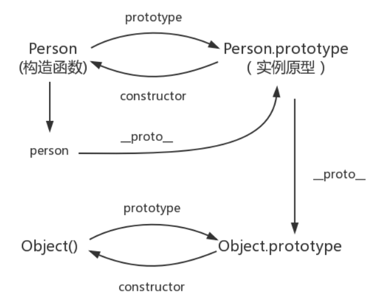
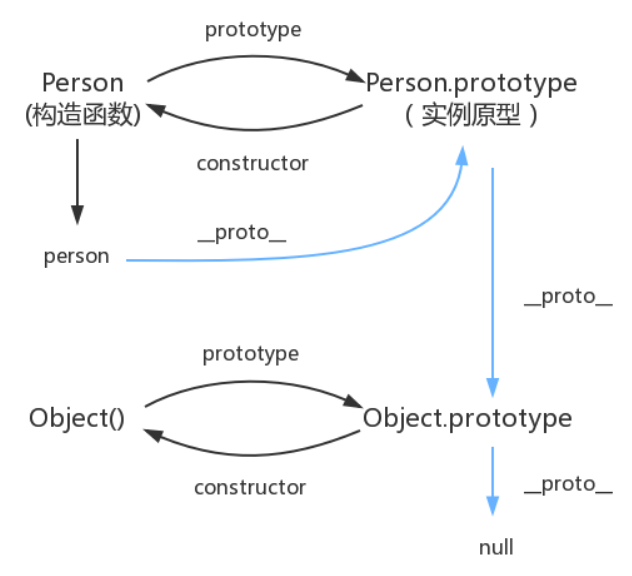

# JavaScript深入之从原型到原型链

## 1. 构造函数

```javascript
// 构造函数
function Person() {

}
// 构造函数创建一个实例对象person
var person = new Person();
```

## 2. `prototype`

每个函数都有一个 `prototype` 属性。**只有函数才有的属性**。

函数的 `prototype` 属性指向了一个对象，这个对象正是调用该构造函数而创建的实例的原型。

什么是原型？每一个JavaScript对象（null除外）在创建的时候就会与之关联另一个对象，这个对象就是我们所说的原型，每一个对象都会从原型“继承”属性。



## 3. `__proto__`

每一个JavaScript对象（除了null）都具有的一个属性，叫 `__proto__` ,这个属性会指向该对象的原型。

```javascript
console.log(person.__proto__ === Person.prototype)  // true
```



## 4. `constructor`

既然实例对象和构造函数都可以指向原型，那么原型是否有属性指向构造函数或者实例呢？

指向实例倒是没有，因为一个构造函数可以生成多个实例，但是原型指向构造函数倒是有的，这就要讲到第三个属性：constructor，每个原型都有一个 constructor 属性指向关联的构造函数。

```javascript
console.log(Person === Person.prototype.constructor);
// true
```



所以，综上：

```javascript
function Person() {}
var person = new Person();
console.log(person.__proto__ == Person.prototype) // true
console.log(Person.prototype.constructor == Person) // true
// 顺便学习一个ES5的方法,可以获得对象的原型
console.log(Object.getPrototypeOf(person) === Person.prototype) // true
```

## 5. 原型的原型

原型也是一个对象，既然是对象，我们就可以用最原始的方式创建它，那就是：

```java
var obj = new Object();
obj.name = 'Kevin'
console.log(obj.name) // Kevin
```



## 6. 原型链

Object.prototype 的原型是 null ：

```java
console.log(Object.prototype.__proto__ === null) // true
```

查找属性的时候查到 Object.prototype 就可以停止查找了



## 补充

### `constructor`

```javascript
console.log(person.constructor === Person); // true
// 当获取 person.constructor 时，其实 person 中并没有 constructor 属性,当不能读取到constructor 属性时，会从 person 的原型也就是 Person.prototype 中读取，正好原型中有该属性，所以：
person.constructor === Person.prototype.constructor
```

### `__proto__`

绝大部分浏览器都支持这个非标准的方法访问原型，然而它并不存在于 Person.prototype 中，

实际上，它是来自于 Object.prototype ，与其说是一个属性，不如说是一个 getter/setter，

当使用 `obj.__proto__` 时，可以理解成返回了 `Object.getPrototypeOf(obj)`。

### 真的是继承吗？

最后是关于继承，前面我们讲到“每一个对象都会从原型‘继承’属性”，实际上，继承是一个十分具有迷惑性的说法，引用《你不知道的JavaScript》中的话，就是：

继承意味着复制操作，然而 JavaScript 默认并不会复制对象的属性，相反，JavaScript 只是在两个对象之间创建一个关联，这样，一个对象就可以通过委托访问另一个对象的属性和函数，所以与其叫继承，委托的说法反而更准确些。

### undefined 和 null

(1) **相似性**

在JavaScript中，将一个变量赋值为undefined或null，老实说，几乎没区别。

```javascript
undefined == null  // true
```

(2) **最初设计**

JavaScript的最初版本是这样区分的：**null是一个表示"无"的对象，转为数值时为0；undefined是一个表示"无"的原始值，转为数值时为NaN。**

(3) **目前用法**

目前，null和undefined基本是同义的，只有一些细微的差别。

**null表示"没有对象"，即该处不应该有值。**典型用法是：

- 作为函数的参数，表示该函数的参数不是对象。
- 作为对象原型链的终点。

```javascript
Object.getPrototypeOf(Object.prototype)  // null
```

**undefined表示"缺少值"，就是此处应该有一个值，但是还没有定义。**典型用法是：

- 变量被声明了，但没有赋值时，就等于undefined。
- 调用函数时，应该提供的参数没有提供，该参数等于undefined。
- 对象没有赋值的属性，该属性的值为undefined。
- 函数没有返回值时，默认返回undefined。

```javascript
var i;
i // undefined

function f(x){console.log(x)}
f() // undefined

var  o = new Object();
o.p // undefined

var x = f();
x // undefined
```
